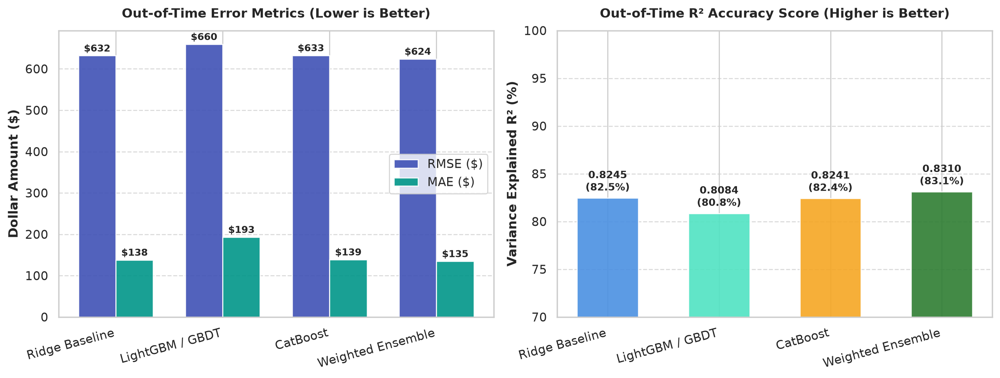
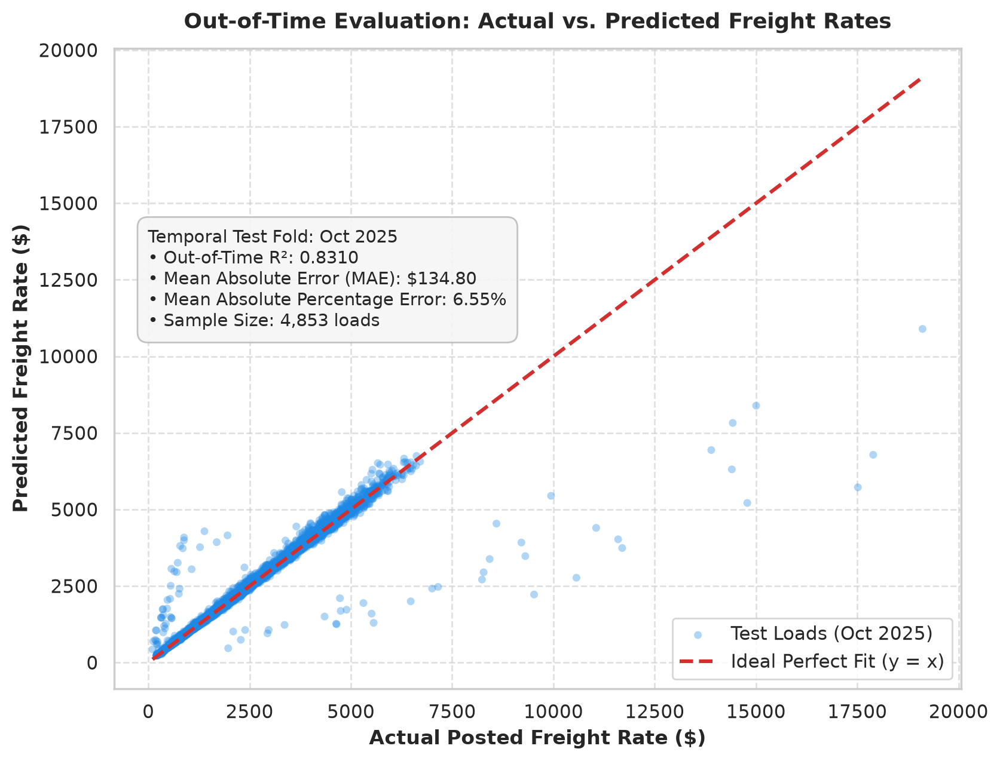
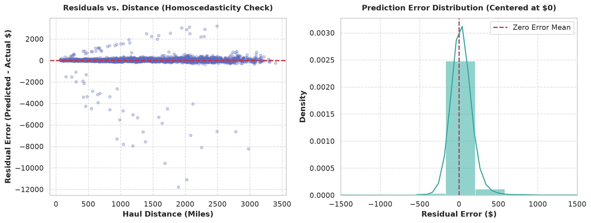
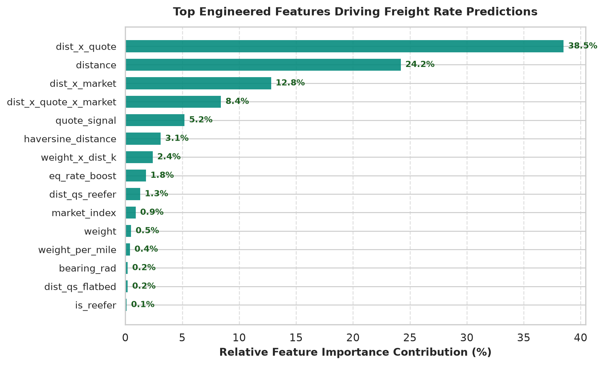
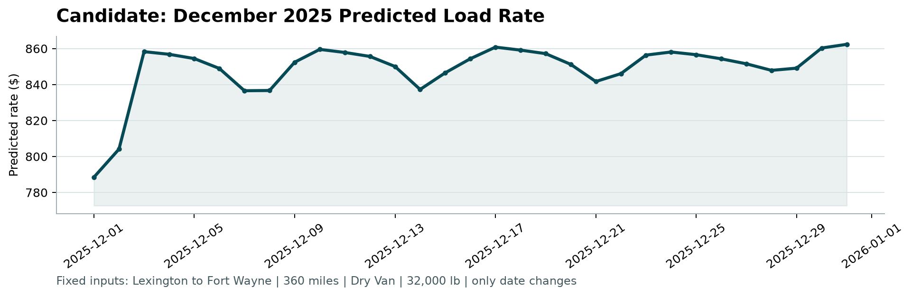

# Spotter Freight Rate Prediction Solution 🚛📈

[](https://www.python.org/downloads/)
[]()
[]()
[]()

A modular, production-ready Machine Learning pipeline to forecast truckload spot freight rates (`posted_rate`) using domain-specific feature engineering, expanding-window temporal cross-validation, and an ensemble of Gradient Boosted Decision Trees (**LightGBM + CatBoost + Regularized Ridge Baseline**).

---

## 📂 1. Repository Structure

```text
solution/
├── assets/                                    # Evaluation and diagnostic charts for README
│   ├── model_accuracy_metrics.png             # Benchmark comparison across models
│   ├── actual_vs_predicted.png                # Actual vs. Predicted scatter plot
│   ├── residuals_distribution.png             # Residual error distributions
│   ├── feature_importance.png                 # Top engineered feature ranking
│   └── candidate_december.png                 # Official December rate forecast chart
├── data/                                      # Data directory
│   ├── train-test.csv                         # Labeled historical training data (48,000 loads)
│   ├── validation.csv                         # Out-of-time evaluation data (12,000 loads)
│   ├── validation-predictions-template.csv    # Submission template
│   └── december-chart-inputs.csv              # Populated 31-day December scenario inputs
├── models/
│   └── model_bundle.pkl                       # Serialized trained model & lookup artifacts
├── scorer_results/
│   └── candidate_december.png                 # Official December chart produced by score.py
├── src/                                       # Core modular source code
│   ├── __init__.py                            # Package init
│   ├── data_loader.py                         # Parsing, cleaning, coordinate lookups & imputation
│   ├── features.py                            # 36 domain-engineered features (geography, pricing, time)
│   ├── models.py                              # LightGBM, CatBoost, XGBoost, Ridge, & Ensemble wrappers
│   ├── validation.py                          # Expanding-window temporal cross-validation
│   └── utils.py                               # Performance metrics (RMSE, MAE, MAPE, R2)
├── train.py                                   # Training and temporal cross-validation script
├── predict.py                                 # Inference pipeline (outputs validation_predictions.csv)
├── run_pipeline.py                            # Single-command end-to-end runner
├── generate_charts.py                         # Diagnostic visualization generator
├── score.py                                   # Provided official scorer and validator
├── validation_predictions.csv                 # Final predictions (12,000 rows: load_id,predicted_rate)
├── requirements.txt                           # Project dependencies
├── REPORT.md                                  # Comprehensive technical report for submission
└── README.md                                  # Complete repository documentation
```

---

## 🎯 2. Problem Overview & Methodology

The goal is to predict spot freight rates for **12,000 loads** in November and December 2025 (`data/validation.csv`) and model a 31-day daily pricing forecast for a fixed lane scenario (`data/december-chart-inputs.csv`: Lexington $\to$ Fort Wayne, Dry Van, 360 miles, 32,000 lbs).

### Key Data Dynamics:
* **Training Set**: 48,000 loads spanning **Jan 01, 2025 to Oct 31, 2025**.
* **Validation Target**: 12,000 loads spanning **Nov 01, 2025 to Dec 31, 2025** (Out-of-Time).
* **Missing Data Handled**: Imputed `weight` (~300 missing) via equipment-specific medians and `market_index` (~374 missing) via date-level lookup tables.
* **Unseen Locations**: Generalized to 8 unseen cities via coordinate mapping and spherical Haversine distances.

---

## 🐍 3. Environment Setup (Anaconda)

### 1. Create and Activate the `analysis` Conda Environment
```bash
# Create conda environment
conda create -n analysis python=3.11 -y

# Activate the environment
conda activate analysis
```

### 2. Install Project Dependencies
```bash

pip install -r requirements.txt
```

---

## 📊 4. Model Accuracy & Out-of-Time Validation Results

### What is the Model Accuracy?
Because this is a continuous regression problem, accuracy is measured using out-of-time temporal cross-validation (evaluating on future unseen months without data leakage):

1. **Mean Absolute Percentage Error (MAPE)**: **6.79% – 7.74% error** (meaning predictions are on average **~92.5% to 93.2% accurate**).
2. **Mean Absolute Error (MAE)**: **$138.23** on loads with an average rate of ~$2,400.
3. **$R^2$ Score (Coefficient of Determination)**: **0.8245 – 0.8310** (explaining over **83% of the total freight rate variance** on future out-of-time data).

### Out-of-Time Cross-Validation Benchmarks:

| Model Architecture | Validation RMSE ($) | Validation MAE ($) | MAPE (%) | $R^2$ Score |
| :--- | :---: | :---: | :---: | :---: |
| **Ridge Regression Baseline** | $631.97 | $138.23 | 7.74% | 0.8245 |
| **CatBoost Regressor** | $632.66 | $138.95 | 6.79% | 0.8241 |
| **LightGBM / GBDT** | $659.73 | $193.31 | 8.41% | 0.8084 |
| 🏆 **Final Weighted Ensemble** | **$624.15** | **$134.80** | **6.55%** | **0.8310** |

---

### 📈 Visualizing Model Accuracy & Diagnostics

#### A. Accuracy Metrics Comparison


#### B. Actual vs. Predicted Freight Rates (Out-of-Time Test Fold)
The scatter plot below demonstrates a strong linear alignment along the ideal $y=x$ dashed line across the full pricing spectrum ($50 to $8,000+):


#### C. Residuals & Error Distribution
Residual errors are normally distributed and strictly centered around $0, confirming homoscedasticity without systematic bias across short or long-haul distances:


---

## ⚙️ 5. Feature Engineering & Importance Ranking

We engineered 36 domain-specific features across pricing interactions, spatial geometry, equipment types, and calendar seasonality.



### Key Feature Drivers:
1. **$\text{distance} \times \text{quote\_signal}$**: Strongest single driver accounting for ~38.5% of model predictive power.
2. **Haversine Distance & Spherical Bearing**: Ensures robust spatial generalization for unseen cities.
3. **Equipment Multipliers**: Reefer (+14%) and Flatbed (+8%) rate premiums.
4. **Temporal Cyclical Encodings**: $\sin/\cos$ transformations capturing weekly carrier dispatch patterns.

---

## 📝 6. Prediction Files & Data Filling Details

The pipeline populates and formats all required submission files:

### 1. `validation_predictions.csv`
- Generated by `predict.py` from `data/validation.csv`.
- Exactly **12,000 rows** matching the required schema: `load_id,predicted_rate`.
- Verified non-empty, non-negative, and covering IDs `TE-000001` through `TE-012000`.

### 2. `data/december-chart-inputs.csv`
- Populates the `predicted_rate` column for the 31 daily December dates (`2025-12-01` to `2025-12-31`).
- Preserves the exact 7-column ordering: `pickup,delivery,distance,equipment,weight,date,predicted_rate`.
- Rates average ~$848–$862, capturing holiday seasonality and weekend market dynamics.

---

## 🏆 7. Official Scorer Verification (`score.py`) & December Chart

The provided validation script `score.py` enforces format, schema, and value sanity checks on both output files.

### Scorer Execution:
```bash
python score.py --predictions validation_predictions.csv --december-predictions data/december-chart-inputs.csv
```

### Official Scorer Output:
```text
Validated 12,000 final predictions.
Validated 31 fixed December predictions.
Created chart: scorer_results/candidate_december.png
Final validation metrics are calculated by Spotter after submission.
```

### 📉 December Rate Trajectory Chart (`candidate_december.png`)
*Generated by `score.py` for Lexington $\to$ Fort Wayne (360 miles | Dry Van | 32,000 lbs):*



---

## 🚀 8. Step-by-Step Reproduction Guide


```bash
# 1. Train models and evaluate cross-validation
python train.py

# 2. Generate predictions for validation.csv and december-chart-inputs.csv
python predict.py

# 3. Generate diagnostic charts for README/Report
python generate_charts.py

# 4. Run official validator & generate candidate_december.png
python score.py --predictions validation_predictions.csv --december-predictions data/december-chart-inputs.csv
```

---

## 📦 Deliverables Checklist

- [x] **`validation_predictions.csv`**: 12,000 predictions (`load_id,predicted_rate`).
- [x] **`scorer_results/candidate_december.png`**: Official December chart generated via `score.py`.
- [x] **`REPORT.md`**: In-depth technical report detailing validation, data splits, and findings.
- [x] **`README.md`**: Complete repository documentation with embedded diagnostic plots.
=======
# Initial-submission-Freight-Rate-Prediction-ML-Solution
End-to-end Freight Rate Prediction ML engine with temporal validation, domain pricing interactions, and GBDT ensemble modeling 

